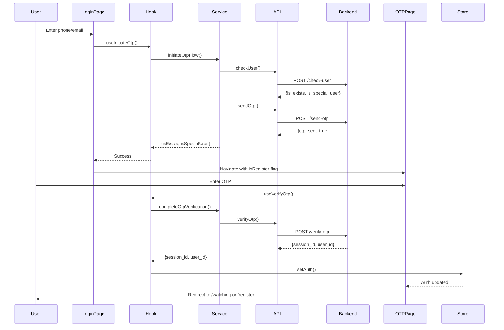
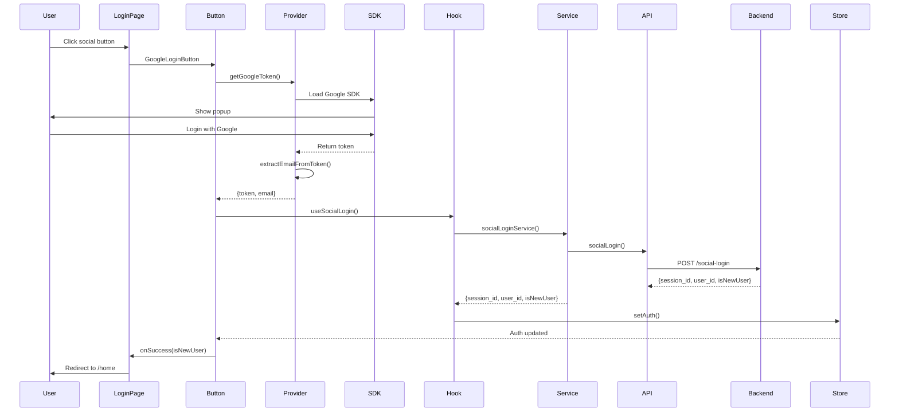
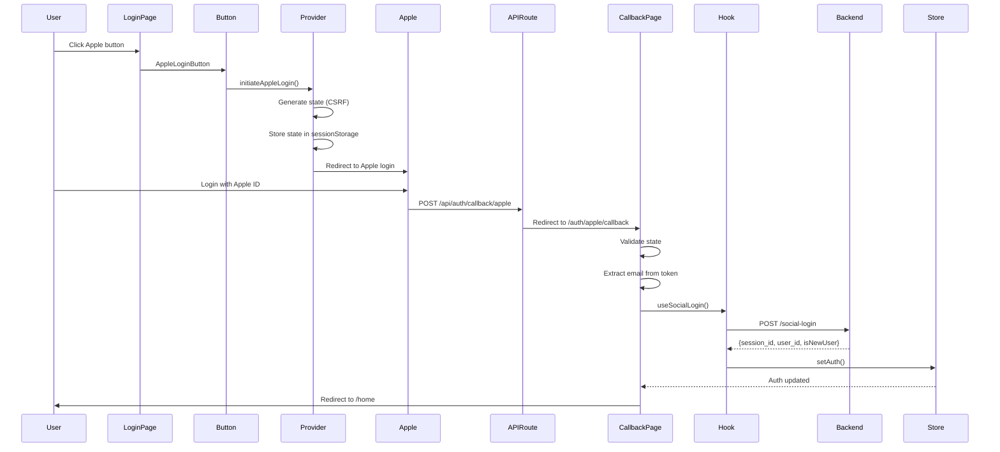

# 🔐 Authentication Flow Documentation

## 📁 Folder Structure

```
features/auth/
├── api/                          # API Layer - Direct backend calls
│   ├── checkUser.ts             # Check if user exists
│   ├── sendOtp.ts               # Send OTP to user
│   ├── verifyOtp.ts             # Verify OTP code
│   ├── socialLogin.ts           # Social login (Google/Facebook/Apple)
│   ├── guestLogin.ts            # Guest login
│   └── verifySpecialUser.ts     # Special user verification
│
├── hooks/                        # React Query Hooks - State management
│   ├── useOtpLogin.ts           # OTP login hooks
│   ├── useSocialLogin.ts        # Social login hook
│   └── useGuestLogin.ts         # Guest login hook
│
├── services/                     # Business Logic - Orchestration
│   └── auth.service.ts          # Auth orchestration (multi-step flows)
│
├── providers/                    # External SDKs - Third-party integrations
│   ├── google.provider.ts       # Google Sign-In SDK
│   ├── facebook.provider.ts     # Facebook Login SDK
│   ├── apple.provider.ts        # Apple Sign-In SDK
│   ├── tokenDecoder.ts          # JWT token decoder
│   ├── loadScript.ts            # Dynamic script loader
│   └── sdkRegistry.ts           # SDK initialization tracker
│
├── model/                        # Data Models - Types & mappers
│   ├── types.ts                 # TypeScript interfaces
│   └── mapper.ts                # API response mappers
│
├── ui/                          # UI Components - Reusable buttons
│   ├── GoogleLoginButton.tsx    # Google login button
│   ├── FacebookLoginButton.tsx  # Facebook login button
│   ├── AppleLoginButton.tsx     # Apple login button
│   ├── GuestLoginButton.tsx     # Guest login button
│   └── OtpLoginForm.tsx         # OTP form component
│
└── SOCIAL_LOGIN_README.md       # Social login setup guide

app/
├── login/                        # Login Pages
│   ├── page.tsx                 # Main login page (phone/email input)
│   ├── validate.ts              # Input validation
│   ├── utils.ts                 # Utility functions
│   └── otp/                     # OTP Verification
│       ├── page.tsx             # OTP input page
│       ├── store.ts             # OTP state management
│       └── utils.ts             # OTP utilities
│
├── register/                     # Registration Pages
│   ├── page.tsx                 # Registration entry
│   └── create-account/          # Profile Creation
│       ├── page.tsx             # Create profile page
│       └── store.ts             # Profile state
│
└── auth/                        # Auth Callbacks
    └── apple/
        └── callback/
            └── page.tsx         # Apple login callback handler

store/
└── useAuthStore.ts              # Global auth state (Zustand)
```

---

## 🧩 Common/Shared Components

These are reusable components used across multiple authentication pages. They provide consistent UI/UX and reduce code duplication.

### 1. AuthForm Component

**Location:** `components/common/AuthForm.tsx`

A reusable authentication form component with built-in country code picker, validation, and social login buttons.

#### Features:
- Phone/Email input with auto-detection
- Country code dropdown with search
- Real-time validation
- Social login buttons (Google, Facebook, Apple)
- Responsive design
- Accessibility support

#### Props Interface:

```typescript
// types/global.types.ts
export interface AuthFormStrings {
  title: string;                    // Form title
  placeholder: string;              // Input placeholder
  disclaimer: React.ReactNode;      // Terms/privacy text (supports JSX)
  nextLabel: string;                // Submit button text
  dividerLabel: string;             // "OR" divider text
  footerText: string;               // Footer text
  footerLinkLabel: string;          // Footer link text
}

export interface AuthFormProps {
  strings: AuthFormStrings;
  
  // State
  value: string;                    // Input value
  error: string | null;             // Error message key
  touched: boolean;                 // Has user interacted?
  canSubmit: boolean;               // Is form valid?
  countryCode: string;              // Selected country code (e.g., "+91")
  dropdownOpen: boolean;            // Is dropdown visible?
  
  // Handlers
  onChange: (e: React.ChangeEvent<HTMLInputElement>) => void;
  onBlur: () => void;
  onSubmit: (e: SubmitEvent) => void;
  onCountryCode: (code: string) => void;
  onDropdownOpen: (open: boolean) => void;
  onFooterLink: () => void;
  
  // Error resolver
  getError: () => string;           // Translates error key to message
}
```

#### Usage Example:

```typescript
// app/login/page.tsx
import { AuthForm } from "@/components/common/AuthForm";
import { useLoginSubmit } from "./useLoginSubmit";

export default function LoginPage() {
  const t = useTranslations("loginPage");
  const router = useRouter();
  
  const {
    value,
    error,
    touched,
    canSubmit,
    countryCode,
    dropdownOpen,
    handleChange,
    handleBlur,
    handleSubmit,
    handleCountryCode,
    handleDropdownOpen,
  } = useLoginSubmit();
  
  const getError = () => {
    if (!error) return "";
    return t(error as any); // Translate error key
  };
  
  return (
    <AuthForm
      strings={{
        title: t("title"),
        placeholder: t("placeholder"),
        disclaimer: (
          <>
            {t("disclaimer_text")}{" "}
            <a href="/terms">{t("terms")}</a>
          </>
        ),
        nextLabel: t("next"),
        dividerLabel: t("or_continue_with"),
        footerText: t("no_account"),
        footerLinkLabel: t("register"),
      }}
      value={value}
      error={error}
      touched={touched}
      canSubmit={canSubmit}
      countryCode={countryCode}
      dropdownOpen={dropdownOpen}
      onChange={handleChange}
      onBlur={handleBlur}
      onSubmit={handleSubmit}
      onCountryCode={handleCountryCode}
      onDropdownOpen={handleDropdownOpen}
      onFooterLink={() => router.push("/register")}
      getError={getError}
    />
  );
}
```

#### Key Implementation Details:

```typescript
// components/common/AuthForm.tsx

// Auto-detect if input is phone or email
const isMobileInput = useMemo(() => 
  REGEX.STARTS_WITH_DIGIT.test(value.trim()), 
  [value]
);

// Country code picker (only shown for phone numbers)
{isMobileInput && (
  <div className="h-full flex items-center shrink-0">
    <Button
      type="button"
      onClick={() => onDropdownOpen(!dropdownOpen)}
      className="h-full px-3.5 flex items-center gap-1"
    >
      {countryCode}
      <ChevronDown size={14} />
    </Button>
    
    {dropdownOpen && (
      <div className="absolute top-[calc(100%+8px)] left-0 w-full">
        {/* Search input */}
        <input
          type="text"
          value={countrySearch}
          onChange={(e) => setCountrySearch(e.target.value)}
          placeholder="Search..."
        />
        
        {/* Country list */}
        {COUNTRY_CODES
          .filter((item) =>
            `${item.code} ${item.country}`
              .toLowerCase()
              .includes(countrySearch.toLowerCase())
          )
          .map((item) => (
            <Button
              key={item.code}
              onClick={() => onCountryCode(item.code)}
            >
              {item.code} - {item.country}
            </Button>
          ))}
      </div>
    )}
  </div>
)}

// Close dropdown on outside click
useEffect(() => {
  const handleDocClick = (e: MouseEvent) => {
    if (dropdownRef.current && !dropdownRef.current.contains(e.target as Node)) {
      onDropdownOpen(false);
    }
  };
  
  if (dropdownOpen) {
    document.addEventListener("mousedown", handleDocClick);
    return () => document.removeEventListener("mousedown", handleDocClick);
  }
}, [dropdownOpen]);
```

---

### 2. OtpScreen Component

**Location:** `components/common/OtpScreen.tsx`

A reusable OTP verification screen with auto-focus, paste support, and resend functionality.

#### Features:
- 4-digit OTP input boxes
- Auto-focus next box on input
- Paste support (auto-fills all boxes)
- Resend OTP with countdown timer
- Multiple delivery methods (SMS, Call)
- Keyboard navigation (Arrow keys, Backspace)
- Supports both login and registration modes

#### Props Interface:

```typescript
// types/global.types.ts
export interface OtpScreenProps {
  mode: OTPScreenMode.LOGIN_MODE | OTPScreenMode.REGISTER_MODE;
}

// enums/ui.enum.ts
export enum OTPScreenMode {
  LOGIN_MODE = "login",
  REGISTER_MODE = "register"
}

export enum OtpDeliveryMethod {
  SMS = "sms",
  CALL = "call",
}
```

#### Usage Example:

```typescript
// app/login/otp/page.tsx
import { OtpScreen } from "@/components/common/OtpScreen";
import { OTPScreenMode } from "@/enums/ui.enum";

export default function LoginOtpPage() {
  return <OtpScreen mode={OTPScreenMode.LOGIN_MODE} />;
}

// app/register/otp/page.tsx
import { OtpScreen } from "@/components/common/OtpScreen";
import { OTPScreenMode } from "@/enums/ui.enum";

export default function RegisterOtpPage() {
  return <OtpScreen mode={OTPScreenMode.REGISTER_MODE} />;
}
```

#### Key Implementation Details:

```typescript
// components/common/OtpScreen.tsx

// Get identifier from URL params
const phone = searchParams.get(LoginIdentifierType.PHONE) ?? "";
const email = searchParams.get(LoginIdentifierType.EMAIL) ?? "";
const identifier = phone || email;
const isEmail = !!email && !phone;
const isRegister = mode === OTPScreenMode.REGISTER_MODE;

// Use OTP store (Zustand)
const {
  digits,           // Array of 4 digits
  activeIndex,      // Currently focused box
  error,            // Error message
  touched,          // Has user interacted?
  countdown,        // Resend countdown (seconds)
  canSubmit,        // All digits filled?
  setDigit,
  setActiveIndex,
  setError,
  startCountdown,
  tickCountdown,
  submitOtp,
  reset,
} = useOtpStore();

// Auto-focus management
useEffect(() => {
  const input = inputRefs.current[activeIndex];
  if (input) {
    input.focus();
    input.setSelectionRange(0, input.value.length);
  }
}, [activeIndex]);

// Handle paste (auto-fill all boxes)
const handlePaste = useCallback(
  (e: React.ClipboardEvent<HTMLInputElement>) => {
    e.preventDefault();
    const pastedText = e.clipboardData.getData('text');
    const digits = pastedText.replace(/\D/g, '').slice(0, OTP_LENGTH_CONST);
    
    digits.split('').forEach((digit, index) => {
      setDigit(index, digit);
    });
    
    setActiveIndex(Math.min(digits.length - 1, OTP_LENGTH_CONST - 1));
    setError(null);
  },
  [setDigit, setActiveIndex, setError]
);

// Handle keyboard navigation
const handleKeyDown = useCallback(
  (e: React.KeyboardEvent<HTMLInputElement>, index: number) => {
    if (e.key === "Backspace") {
      if (digits[index]) {
        setDigit(index, "");
      } else if (index > 0) {
        setDigit(index - 1, "");
        setActiveIndex(index - 1);
      }
    }
    
    if (e.key === "ArrowLeft" && index > 0) {
      setActiveIndex(index - 1);
    }
    
    if (e.key === "ArrowRight" && index < OTP_LENGTH_CONST - 1) {
      setActiveIndex(index + 1);
    }
  },
  [digits, setDigit, setActiveIndex]
);

// Handle input change
const handleChange = useCallback(
  (e: React.ChangeEvent<HTMLInputElement>, index: number) => {
    const raw = e.target.value.replace(REGEX.NON_DIGIT, "");
    if (!raw) return;
    
    // Handle multi-digit paste
    if (raw.length > 1) {
      raw.slice(0, OTP_LENGTH_CONST).split("").forEach((ch, i) => {
        setDigit(i, ch);
      });
      setActiveIndex(Math.min(raw.length, OTP_LENGTH_CONST - 1));
      return;
    }
    
    // Single digit input
    setDigit(index, raw);
    if (index < OTP_LENGTH_CONST - 1) {
      setActiveIndex(index + 1);
    }
  },
  [setDigit, setActiveIndex]
);

// Resend OTP with countdown
const handleResend = (method: OtpDeliveryMethod.SMS | OtpDeliveryMethod.CALL) => {
  if (countdown > 0) return;
  startCountdown();
  logger.info("Resend via", method);
  // TODO: Call resend API
};

// Countdown timer
useEffect(() => {
  if (countdown <= 0) return;
  const id = setInterval(tickCountdown, 1000);
  return () => clearInterval(id);
}, [countdown, tickCountdown]);

// Submit OTP
const handleSubmit = (e: SubmitEvent) => {
  e.preventDefault();
  if (!canSubmit) {
    setError(ErrorKey.REQUIRED);
    return;
  }
  
  submitOtp(() => {
    if (isRegister) {
      const param = phone
        ? `${LoginIdentifierType.PHONE}=${encodeURIComponent(phone)}`
        : `${LoginIdentifierType.EMAIL}=${encodeURIComponent(email)}`;
      router.push(`${ROUTES.REGISTER_CREATE_ACCOUNT}?${param}`);
    } else {
      router.push(ROUTES.HOME);
    }
  });
};
```

#### OTP Input Boxes:

```typescript
// Render OTP input boxes
<div 
  className="grid gap-2 sm:gap-3 w-full" 
  style={{ gridTemplateColumns: `repeat(${OTP_LENGTH_CONST}, 1fr)` }}
>
  {Array.from({ length: OTP_LENGTH_CONST }).map((_, i) => (
    <input
      key={i}
      ref={(el) => { inputRefs.current[i] = el; }}
      type="text"
      inputMode="numeric"
      autoComplete={i === 0 ? "one-time-code" : "off"}
      maxLength={1}
      value={digits[i]}
      onChange={(e) => handleChange(e, i)}
      onKeyDown={(e) => handleKeyDown(e, i)}
      onPaste={handlePaste}
      onFocus={() => setActiveIndex(i)}
      aria-label={`OTP digit ${i + 1}`}
      className={cn(
        "w-full h-12 sm:h-16 rounded-xl text-center text-xl font-bold",
        "bg-bg-surface text-text-base border-2 transition-[border-color]",
        error && touched ? "border-error"
          : activeIndex === i ? "border-primary"
            : digits[i] ? "border-white/25"
              : "border-border"
      )}
    />
  ))}
</div>
```

#### Resend UI:

```typescript
// Resend countdown and buttons
<div className="flex flex-col items-center gap-2.5 w-full text-center">
  <p className="m-0 text-sm text-text-muted">
    {countdown > 0 ? (
      <>
        {t("resend_in")}{" "}
        <span className="text-primary font-semibold tabular-nums">
          {formatTime(countdown)}
        </span>
      </>
    ) : (
      <Button
        type="button"
        variant="link"
        onClick={() => handleResend(OtpDeliveryMethod.SMS)}
        className="text-primary font-semibold hover:underline"
      >
        {t("resend_now")}
      </Button>
    )}
  </p>
  
  <div className="flex items-center gap-4">
    <Button
      type="button"
      variant="ghost"
      onClick={() => handleResend(OtpDeliveryMethod.SMS)}
      disabled={countdown > 0}
      className="flex items-center gap-1.5 text-[13px]"
    >
      <MessageSquare size={13} />
      {t("via_sms")}
    </Button>
    
    <span className="text-border">|</span>
    
    <Button
      type="button"
      variant="ghost"
      onClick={() => handleResend(OtpDeliveryMethod.CALL)}
      disabled={countdown > 0}
      className="flex items-center gap-1.5 text-[13px]"
    >
      <Phone size={13} />
      {t("via_call")}
    </Button>
  </div>
</div>
```

---

### 3. OTP Store (Zustand)

**Location:** `app/login/otp/store.ts`

Centralized state management for OTP verification using Zustand.

#### State Interface:

```typescript
// types/global.types.ts
export interface OtpState {
  digits: string[];              // Array of OTP_LENGTH single chars
  activeIndex: number;           // Currently focused input box
  error: string | null;          // Error message key
  touched: boolean;              // Has user interacted?
  countdown: number;             // Seconds remaining before resend allowed
  canSubmit: boolean;            // All digits filled?
  
  // Actions
  setDigit: (index: number, value: string) => void;
  setActiveIndex: (index: number) => void;
  setError: (key: string | null) => void;
  startCountdown: () => void;
  tickCountdown: () => void;
  submitOtp: (onSuccess: () => void) => void;
  reset: () => void;
}
```

#### Store Implementation:

```typescript
// app/login/otp/store.ts
import { create } from "zustand";
import { appConfig } from "@/lib/config/app.config";
import { logger } from "@/lib/logger/logger";
import { INITIAL_FOR_OTP } from "@/lib/utils";

export const useOtpStore = create<OtpState>((set, get) => ({
  ...INITIAL_FOR_OTP,
  
  // Set single digit
  setDigit: (index, value) => {
    const digits = [...get().digits];
    digits[index] = value.slice(-1); // Keep only last char
    const canSubmit = digits.every((d) => d !== "");
    set({ digits, canSubmit, error: null });
  },
  
  // Set active input box
  setActiveIndex: (activeIndex) => set({ activeIndex }),
  
  // Set error message
  setError: (error) => set({ error, touched: true }),
  
  // Start resend countdown
  startCountdown: () => set({ countdown: appConfig.RESEND_SECONDS }),
  
  // Tick countdown (called every second)
  tickCountdown: () => {
    const { countdown } = get();
    if (countdown > 0) set({ countdown: countdown - 1 });
  },
  
  // Submit OTP
  submitOtp: (onSuccess) => {
    const { digits } = get();
    const otp = digits.join("");
    
    if (otp.length < appConfig.OTP_LENGTH) {
      set({ error: "error_required", touched: true });
      return;
    }
    
    // TODO: Call verify OTP API
    logger.info("[OTP Store] Verifying OTP", { otp });
    onSuccess();
  },
  
  // Reset to initial state
  reset: () => set({ ...INITIAL_FOR_OTP }),
}));

export const OTP_LENGTH_CONST = appConfig.OTP_LENGTH;
```

#### Initial State:

```typescript
// lib/utils.ts
export const INITIAL_FOR_OTP = {
  digits: ["", "", "", ""],
  activeIndex: 0,
  error: null,
  touched: false,
  countdown: 0,
  canSubmit: false,
};
```

#### Usage in Components:

```typescript
// Any component can access OTP store
import { useOtpStore } from "@/app/login/otp/store";

function MyComponent() {
  const { digits, canSubmit, setDigit, submitOtp } = useOtpStore();
  
  // Use store state and actions
  const handleSubmit = () => {
    submitOtp(() => {
      router.push("/home");
    });
  };
  
  return (
    <button onClick={handleSubmit} disabled={!canSubmit}>
      Submit OTP
    </button>
  );
}
```

---

### 4. Component Reusability Pattern

#### How Components Are Reused:

```
AuthForm Component
├── Used in: app/login/page.tsx (Login)
├── Used in: app/register/page.tsx (Registration)
└── Customized via: strings prop (different text for each page)

OtpScreen Component
├── Used in: app/login/otp/page.tsx (Login OTP)
├── Used in: app/register/otp/page.tsx (Registration OTP)
└── Customized via: mode prop (LOGIN_MODE vs REGISTER_MODE)

OTP Store (Zustand)
├── Used by: OtpScreen component
├── Used by: app/login/otp/page.tsx
├── Used by: app/register/otp/page.tsx
└── Shared state across all OTP pages
```

#### Benefits of This Pattern:

1. **DRY (Don't Repeat Yourself)**: Write once, use everywhere
2. **Consistency**: Same UI/UX across login and registration
3. **Maintainability**: Fix bugs in one place
4. **Testability**: Test components in isolation
5. **Flexibility**: Customize via props without duplicating code

#### Example: Login vs Register Pages

```typescript
// app/login/page.tsx (Login)
<AuthForm
  strings={{
    title: "Welcome Back",
    footerText: "Don't have an account?",
    footerLinkLabel: "Sign Up",
  }}
  onFooterLink={() => router.push("/register")}
  {...otherProps}
/>

// app/register/page.tsx (Registration)
<AuthForm
  strings={{
    title: "Create Account",
    footerText: "Already have an account?",
    footerLinkLabel: "Sign In",
  }}
  onFooterLink={() => router.push("/login")}
  {...otherProps}
/>
```

---

### 5. Validation and Error Handling

#### Error Keys (Enums):

```typescript
// enums/ui.enum.ts
export enum ErrorKey {
  REQUIRED = "error_required",
  INVALID_EMAIL = "error_invalid_email",
  INVALID_PHONE = "error_invalid_phone",
  ERR_INVALID = "error_invalid",
  ERR_EXPIRED = "error_expired",
  ERR_AGE_REQUIRED = "error_age_required",
  ERR_GENDER_REQUIRED = "error_gender_required",
  ERR_NAME_REQUIRED = "error_name_required"
}
```

#### Validation Logic:

```typescript
// app/login/validate.ts
import { ErrorKey } from "@/enums/ui.enum";
import { REGEX } from "@/lib/constants/regex";

export function validate(value: string): ErrorKey | null {
  if (!value.trim()) {
    return ErrorKey.REQUIRED;
  }
  
  // Check if email
  if (REGEX.EMAIL.test(value)) {
    return null; // Valid email
  }
  
  // Check if phone
  if (REGEX.PHONE_FORMAT.test(value)) {
    return null; // Valid phone
  }
  
  // Invalid format
  return value.includes('@') 
    ? ErrorKey.INVALID_EMAIL 
    : ErrorKey.INVALID_PHONE;
}
```

#### Error Display in Components:

```typescript
// components/common/AuthForm.tsx
{error && touched && (
  <p role="alert" className="text-xs text-error pl-4 flex items-center gap-1">
    <span 
      className="inline-flex items-center justify-center w-[14px] h-[14px] rounded-full bg-error text-white text-[9px] font-black"
      aria-hidden="true"
    >
      !
    </span>
    {getError()}
  </p>
)}
```

---

### 6. Accessibility Features

#### Keyboard Navigation:

```typescript
// OtpScreen supports full keyboard navigation
- Tab: Move between input boxes
- Arrow Left/Right: Navigate between boxes
- Backspace: Delete current digit or move to previous box
- Paste: Auto-fill all boxes from clipboard
```

#### ARIA Labels:

```typescript
// Proper ARIA labels for screen readers
<input
  aria-label={`OTP digit ${i + 1}`}
  role="textbox"
  aria-invalid={error && touched}
  aria-describedby={error ? "otp-error" : undefined}
/>

<p id="otp-error" role="alert">
  {error && touched && getError()}
</p>
```

#### Focus Management:

```typescript
// Auto-focus on mount
useEffect(() => {
  reset();
  setActiveIndex(0);
  const timer = setTimeout(() => inputRefs.current[0]?.focus(), 100);
  return () => clearTimeout(timer);
}, []);

// Auto-focus on active index change
useEffect(() => {
  const input = inputRefs.current[activeIndex];
  if (input) {
    input.focus();
    input.setSelectionRange(0, input.value.length);
  }
}, [activeIndex]);
```

---

## 🔄 Authentication Flows

### 1. OTP Login Flow (Phone/Email)



#### Code Example:

**Step 1: Login Page (Phone/Email Input)**

```typescript
// app/login/page.tsx
import { useInitiateOtp } from "@features/auth/hooks/useOtpLogin";

export default function LoginPage() {
  const initiateOtp = useInitiateOtp();
  
  const handleSubmit = async (phone: string, phoneCode: string) => {
    try {
      // Call hook to initiate OTP
      const result = await initiateOtp.mutateAsync({ 
        phone, 
        phoneCode 
      });
      
      // Navigate to OTP page with isRegister flag
      const isRegister = !result.isExists;
      router.push(`/login/otp?phone=${phone}&isRegister=${isRegister}`);
    } catch (error) {
      // Error handled by hook
    }
  };
}
```

**Step 2: Hook Layer**

```typescript
// features/auth/hooks/useOtpLogin.ts
export function useInitiateOtp() {
  return useMutation({
    mutationFn: ({ phone, phoneCode }) => {
      const sessionId = useAuthStore.getState().token;
      return initiateOtpFlow(phone, phoneCode, sessionId);
    },
    onError: (error) => {
      logger.error("[OTP Initiate Error]", { error });
    },
  });
}
```

**Step 3: Service Layer (Orchestration)**

```typescript
// features/auth/services/auth.service.ts
export async function initiateOtpFlow(
  phone: string,
  phoneCode: string,
  sessionId?: string
): Promise<{ isSpecialUser: boolean; isExists: boolean }> {
  // Step 1: Check if user exists
  const userCheckResponse = await checkUser({
    phone_code: phoneCode,
    phone: phone,
    source: phone.includes('@') ? "email" : "phone",
  }, sessionId);
  
  const userCheck = mapCheckUserResponse(userCheckResponse);
  
  // Step 2: Send OTP
  const isRegistration = !userCheck.is_exists;
  
  const otpResponse = await sendOtp({
    phone_code: phoneCode,
    phone: phone,
    is_register: isRegistration,
    source: phone.includes('@') ? "email" : "phone",
  }, sessionId);
  
  return {
    isSpecialUser: userCheck.is_special_user,
    isExists: userCheck.is_exists,
  };
}
```

**Step 4: API Layer**

```typescript
// features/auth/api/checkUser.ts
export async function checkUser(
  request: CheckUserRequest,
  sessionId?: string
): Promise<ApiResponse<CheckUserResponse>> {
  return apiClient.post('/check-user', request, {
    headers: sessionId ? { 'session-id': sessionId } : {},
  });
}

// features/auth/api/sendOtp.ts
export async function sendOtp(
  request: SendOtpRequest,
  sessionId?: string
): Promise<ApiResponse<SendOtpResponse>> {
  return apiClient.post('/send-otp', request, {
    headers: sessionId ? { 'session-id': sessionId } : {},
  });
}
```

**Step 5: OTP Verification Page**

```typescript
// app/login/otp/page.tsx
import { useVerifyOtp } from "@features/auth/hooks/useOtpLogin";

export default function OtpPage() {
  const verifyOtp = useVerifyOtp();
  const isRegister = searchParams.get("isRegister") === "true";
  
  const handleSubmit = async (otp: string) => {
    try {
      await verifyOtp.mutateAsync({ 
        phone, 
        phoneCode, 
        otp, 
        isRegister 
      });
      
      // Hook updates auth store automatically
      // Redirect based on user type
      if (isRegister) {
        router.push("/register/create-account");
      } else {
        router.push("/watching");
      }
    } catch (error) {
      // Error handled by hook
    }
  };
}
```

---

### 2. Social Login Flow (Google/Facebook)



#### Code Example:

**Step 1: Social Login Button**

```typescript
// features/auth/ui/GoogleLoginButton.tsx
export function GoogleLoginButton({ onSuccess, onError }) {
  const { mutate } = useSocialLogin();
  
  const handleGoogleLogin = async () => {
    try {
      // Get token from Google SDK
      const token = await getGoogleToken();
      
      // Extract email from token
      const email = extractEmailFromToken(token, 'google');
      
      // Call mutation
      mutate(
        { source: "google", token, email },
        {
          onSuccess: (data) => {
            onSuccess?.(data.isNewUser);
          },
          onError: (error) => {
            onError?.(error);
          },
        }
      );
    } catch (error) {
      onError?.(error);
    }
  };
  
  return (
    <button onClick={handleGoogleLogin}>
      Sign in with Google
    </button>
  );
}
```

**Step 2: Google Provider (SDK Integration)**

```typescript
// features/auth/providers/google.provider.ts
export async function getGoogleToken(): Promise<string> {
  // Initialize Google SDK
  await initializeGoogleSDK();
  
  // Show Google popup
  const response = await window.google.accounts.oauth2.initTokenClient({
    client_id: process.env.NEXT_PUBLIC_GOOGLE_CLIENT_ID,
    scope: 'email profile',
    callback: (tokenResponse) => {
      return tokenResponse.access_token;
    },
  });
  
  return response.access_token;
}
```

**Step 3: Social Login Hook**

```typescript
// features/auth/hooks/useSocialLogin.ts
export function useSocialLogin() {
  const { setAuth } = useAuthStore();
  
  return useMutation({
    mutationFn: (request: SocialLoginRequest) => {
      const sessionId = useAuthStore.getState().token;
      return socialLoginService(request, sessionId);
    },
    onSuccess: (data) => {
      // Update auth store
      setAuth(
        {
          id: data.user_id,
          email: data.email,
          isGuest: false,
        },
        data.session_id,
        ""
      );
      
      logger.info("[Social Login Success]", { 
        userId: data.user_id,
        isNewUser: data.isNewUser 
      });
    },
    onError: (error) => {
      logger.error("[Social Login Error]", { error });
    },
  });
}
```

**Step 4: Social Login Service**

```typescript
// features/auth/services/auth.service.ts
export async function socialLoginService(
  request: SocialLoginRequest,
  sessionId?: string
): Promise<SocialLoginResponse> {
  // Call social login API
  const response = await socialLogin(request, sessionId);
  
  // Validate status (accept 200 and 201)
  const status = response.metaData?.status;
  if (status !== 200 && status !== 201) {
    throw new AppError('Social login failed', status);
  }
  
  // Map response
  const mapped = mapSocialLoginResponse(response);
  
  // Add isNewUser flag
  const isNewUser = status === 201;
  
  return {
    ...mapped,
    isNewUser,
  };
}
```

---

### 3. Apple Login Flow (Redirect-based)



#### Code Example:

**Step 1: Apple Login Button**

```typescript
// features/auth/ui/AppleLoginButton.tsx
export function AppleLoginButton({ onError }) {
  const handleAppleLogin = async () => {
    try {
      // Initiate Apple sign-in (will redirect)
      await initiateAppleLogin();
      
      // Code after this won't execute (redirect happens)
    } catch (error) {
      onError?.(error);
    }
  };
  
  return (
    <button onClick={handleAppleLogin}>
      Sign in with Apple
    </button>
  );
}
```

**Step 2: Apple Provider**

```typescript
// features/auth/providers/apple.provider.ts
export async function initiateAppleLogin(): Promise<void> {
  // Initialize Apple SDK
  await initializeAppleSDK();
  
  // Generate CSRF state
  const state = crypto.randomUUID();
  sessionStorage.setItem('apple_auth_state', state);
  
  // Trigger Apple sign-in (redirects to Apple)
  await window.AppleID.auth.signIn();
}

export function validateAppleState(receivedState: string): boolean {
  const storedState = sessionStorage.getItem('apple_auth_state');
  return receivedState === storedState;
}
```

**Step 3: API Route (Bridge)**

```typescript
// app/api/auth/callback/apple/route.ts
export async function POST(request: NextRequest) {
  // Get form data from Apple
  const formData = await request.formData();
  const idToken = formData.get('id_token');
  const code = formData.get('code');
  const state = formData.get('state');
  
  // Build redirect URL to client page
  const callbackUrl = new URL('/auth/apple/callback', request.nextUrl.origin);
  callbackUrl.searchParams.set('id_token', idToken);
  callbackUrl.searchParams.set('state', state);
  
  // Redirect to client-side callback page
  return NextResponse.redirect(callbackUrl);
}
```

**Step 4: Callback Page**

```typescript
// app/auth/apple/callback/page.tsx
export default function AppleCallbackPage() {
  const { mutate } = useSocialLogin();
  
  useEffect(() => {
    const idToken = searchParams.get('id_token');
    const state = searchParams.get('state');
    
    // Validate CSRF state
    if (!validateAppleState(state)) {
      router.push('/login?error=state_mismatch');
      return;
    }
    
    // Extract email from token
    const email = extractEmailFromToken(idToken, 'apple');
    
    // Call social login
    mutate(
      { source: "apple", token: idToken, email },
      {
        onSuccess: (data) => {
          router.push('/home');
        },
        onError: (error) => {
          router.push('/login?error=apple_failed');
        },
      }
    );
  }, []);
  
  return <Loader />;
}
```

---

## 📦 Data Models

### Request/Response Types

```typescript
// features/auth/model/types.ts

// OTP Login
export interface CheckUserRequest {
  phone_code: string;
  phone: string;
  source: "phone" | "email";
}

export interface CheckUserResponse {
  is_exists: boolean;
  is_special_user: boolean;
  operator_name: string | null;
}

export interface SendOtpRequest {
  phone_code: string;
  phone: string;
  is_register: boolean;
  source: "phone" | "email";
}

export interface VerifyOtpRequest {
  phone_code: string;
  phone: string;
  otp: string;
  is_register: boolean;
  source: "phone" | "email";
}

export interface VerifyOtpResponse {
  session_id: string;
  user_id: string;
  email?: string;
  phone: string;
  phone_code: string;
}

// Social Login
export type SocialProvider = 'google' | 'facebook' | 'apple';

export interface SocialLoginRequest {
  source: SocialProvider;
  token: string;
  email?: string;
}

export interface SocialLoginResponse {
  session_id: string;
  user_id: string;
  email?: string;
  phone?: string;
  isNewUser?: boolean;
}

// Auth State
export interface User {
  id: string;
  phone: string;
  name?: string;
  email?: string;
  avatar?: string;
  isGuest: boolean;
  createdAt: string;
}

export interface AuthState {
  isAuthenticated: boolean;
  user: User | null;
  token: string | null;
  refreshToken: string | null;
}
```

### Response Mappers

```typescript
// features/auth/model/mapper.ts

export function mapCheckUserResponse(
  response: ApiResponse<any>
): CheckUserResponse {
  return {
    is_exists: response.data?.is_exists ?? false,
    is_special_user: response.data?.is_special_user ?? false,
    operator_name: response.data?.operator_name ?? null,
  };
}

export function mapVerifyOtpResponse(
  response: ApiResponse<any>
): VerifyOtpResponse {
  return {
    session_id: response.data?.session_id ?? '',
    user_id: response.data?.user_id ?? '',
    email: response.data?.email,
    phone: response.data?.phone ?? '',
    phone_code: response.data?.phone_code ?? '',
  };
}

export function mapSocialLoginResponse(
  response: ApiResponse<any>
): SocialLoginResponse {
  return {
    session_id: response.data?.session_id ?? '',
    user_id: response.data?.user_id ?? '',
    email: response.data?.email,
    phone: response.data?.phone,
  };
}
```

---

## 🏪 State Management

### Auth Store (Zustand)

```typescript
// store/useAuthStore.ts
import { create } from 'zustand';
import { persist } from 'zustand/middleware';

interface AuthStore {
  isAuthenticated: boolean;
  user: User | null;
  token: string | null;
  refreshToken: string | null;
  
  setAuth: (user: User, token: string, refreshToken: string) => void;
  clearAuth: () => void;
  updateUser: (user: Partial<User>) => void;
}

export const useAuthStore = create<AuthStore>()(
  persist(
    (set) => ({
      isAuthenticated: false,
      user: null,
      token: null,
      refreshToken: null,
      
      setAuth: (user, token, refreshToken) => set({
        isAuthenticated: true,
        user,
        token,
        refreshToken,
      }),
      
      clearAuth: () => set({
        isAuthenticated: false,
        user: null,
        token: null,
        refreshToken: null,
      }),
      
      updateUser: (userData) => set((state) => ({
        user: state.user ? { ...state.user, ...userData } : null,
      })),
    }),
    {
      name: 'auth-storage',
    }
  )
);
```

---

## 🎨 Architecture Patterns

### 1. Layered Architecture

```
┌─────────────────────────────────────────┐
│           UI Layer (Pages)              │
│  - Login Page                           │
│  - OTP Page                             │
│  - Register Page                        │
└─────────────────┬───────────────────────┘
                  │
┌─────────────────▼───────────────────────┐
│        Hook Layer (React Query)         │
│  - useInitiateOtp()                     │
│  - useVerifyOtp()                       │
│  - useSocialLogin()                     │
└─────────────────┬───────────────────────┘
                  │
┌─────────────────▼───────────────────────┐
│      Service Layer (Orchestration)      │
│  - initiateOtpFlow()                    │
│  - completeOtpVerification()            │
│  - socialLoginService()                 │
└─────────────────┬───────────────────────┘
                  │
┌─────────────────▼───────────────────────┐
│         API Layer (HTTP Calls)          │
│  - checkUser()                          │
│  - sendOtp()                            │
│  - verifyOtp()                          │
│  - socialLogin()                        │
└─────────────────┬───────────────────────┘
                  │
┌─────────────────▼───────────────────────┐
│            Backend API                  │
│  - POST /check-user                     │
│  - POST /send-otp                       │
│  - POST /verify-otp                     │
│  - POST /social-login                   │
└─────────────────────────────────────────┘
```

### 2. Separation of Concerns

| Layer | Responsibility | Can Access |
|-------|---------------|------------|
| **UI** | User interaction, display | Hooks, Store |
| **Hook** | React Query, caching | Service, Store |
| **Service** | Business logic, orchestration | API |
| **API** | HTTP calls, error handling | Backend |
| **Provider** | External SDKs | SDK APIs |

### 3. Data Flow

```
User Input → UI → Hook → Service → API → Backend
                   ↓
                 Store (Auth State)
                   ↓
              UI Updates
```

---

## 🔒 Security Features

### 1. CSRF Protection (Apple Login)

```typescript
// Generate state
const state = crypto.randomUUID();
sessionStorage.setItem('apple_auth_state', state);

// Validate state
const receivedState = searchParams.get('state');
const storedState = sessionStorage.getItem('apple_auth_state');
if (receivedState !== storedState) {
  throw new Error('CSRF validation failed');
}
```

### 2. Token Handling

```typescript
// Never store tokens in localStorage
// Use httpOnly cookies or secure sessionStorage

// Store session ID (not the actual token)
setAuth(user, session_id, '');

// Send session ID in headers
headers: {
  'session-id': sessionId,
}
```

### 3. Input Validation

```typescript
// Validate phone/email before sending
export function validate(value: string): ErrorKey | null {
  if (!value) return "error_required";
  
  if (REGEX.EMAIL.test(value)) {
    return null; // Valid email
  }
  
  if (REGEX.PHONE_FORMAT.test(value)) {
    return null; // Valid phone
  }
  
  return "error_invalid";
}
```

---

## 🧪 Testing Examples

### Unit Test (Service)

```typescript
// features/auth/services/__tests__/auth.service.test.ts
describe('initiateOtpFlow', () => {
  it('should check user and send OTP for new user', async () => {
    // Mock API responses
    mockCheckUser.mockResolvedValue({
      data: { is_exists: false, is_special_user: false },
      metaData: { status: 200 },
    });
    
    mockSendOtp.mockResolvedValue({
      data: { otp_sent: true },
      metaData: { status: 200 },
    });
    
    // Call service
    const result = await initiateOtpFlow('1234567890', '+91');
    
    // Assertions
    expect(result.isExists).toBe(false);
    expect(mockSendOtp).toHaveBeenCalledWith(
      expect.objectContaining({ is_register: true })
    );
  });
});
```

### Integration Test (Hook)

```typescript
// features/auth/hooks/__tests__/useOtpLogin.test.tsx
describe('useInitiateOtp', () => {
  it('should initiate OTP and return user status', async () => {
    const { result } = renderHook(() => useInitiateOtp(), {
      wrapper: QueryClientProvider,
    });
    
    // Trigger mutation
    await act(async () => {
      await result.current.mutateAsync({
        phone: '1234567890',
        phoneCode: '+91',
      });
    });
    
    // Assertions
    expect(result.current.isSuccess).toBe(true);
    expect(result.current.data).toEqual({
      isExists: false,
      isSpecialUser: false,
    });
  });
});
```

---

## 📝 Best Practices

### 1. Error Handling

```typescript
// Always use try-catch in services
try {
  const response = await checkUser(request);
  return mapCheckUserResponse(response);
} catch (error) {
  logger.error('[Auth Service] Check user failed', { error });
  throw new AppError('Failed to check user', HttpStatus.INTERNAL_SERVER_ERROR);
}
```

### 2. Logging

```typescript
// Use structured logging
logger.info('[Auth Service] Initiating OTP flow', {
  phone: phone.slice(-4), // Only log last 4 digits
  source: isEmail ? 'email' : 'phone',
});

logger.error('[Auth Service] OTP verification failed', {
  error: error.message,
  userId: user?.id,
});
```

### 3. Type Safety

```typescript
// Always define types for API responses
interface ApiResponse<T> {
  data: T | null;
  metaData: {
    status: number;
    message: string;
  };
}

// Use type guards
function isValidOtpResponse(data: any): data is VerifyOtpResponse {
  return (
    typeof data?.session_id === 'string' &&
    typeof data?.user_id === 'string'
  );
}
```

### 4. Code Organization

```typescript
// ✅ Good: Single responsibility
export function useInitiateOtp() {
  return useMutation({
    mutationFn: initiateOtpFlow,
  });
}

// ❌ Bad: Mixed responsibilities
export function useOtpLogin() {
  // Don't mix initiate and verify in one hook
}
```

---

## 🚀 Quick Start Guide

### 1. Setup Environment Variables

```bash
# .env.development
NEXT_PUBLIC_GOOGLE_CLIENT_ID=your_google_client_id
NEXT_PUBLIC_FACEBOOK_APP_ID=your_facebook_app_id
NEXT_PUBLIC_APPLE_CLIENT_ID=your_apple_service_id
NEXT_PUBLIC_APPLE_REDIRECT_URI=https://yourdomain.com/api/auth/callback/apple
```

### 2. Initialize Auth Store

```typescript
// app/providers.tsx
import { useAuthStore } from '@store/useAuthStore';

export function Providers({ children }) {
  const { isAuthenticated } = useAuthStore();
  
  return (
    <QueryClientProvider client={queryClient}>
      {children}
    </QueryClientProvider>
  );
}
```

### 3. Protect Routes

```typescript
// middleware.ts
export function middleware(request: NextRequest) {
  const token = request.cookies.get('session-id');
  
  if (!token && request.nextUrl.pathname.startsWith('/watching')) {
    return NextResponse.redirect(new URL('/login', request.url));
  }
}
```

---

## 📚 Additional Resources

- [Social Login Setup Guide](./SOCIAL_LOGIN_README.md)
- [Apple Login Setup Guide](./APPLE_LOGIN_SETUP.md)
- [API Documentation](../../docs/API.md)
- [Testing Guide](../../docs/TESTING.md)

---

## 🤝 Contributing

When adding new auth features:

1. Follow the layered architecture
2. Add types to `model/types.ts`
3. Add mappers to `model/mapper.ts`
4. Create API functions in `api/`
5. Create hooks in `hooks/`
6. Add services if orchestration needed
7. Update this documentation

---

## 📞 Support

For questions or issues:
- Check existing documentation
- Review code examples above
- Contact the development team

---

**Last Updated:** 2026-05-02
**Version:** 2.0.0
